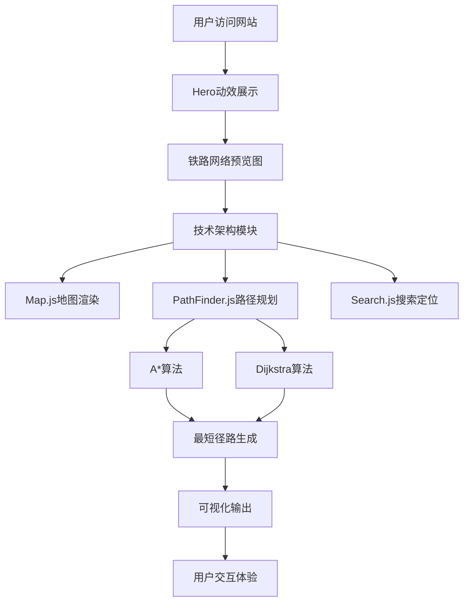

# 中图铁路地图 - 产品需求文档

## 1. 产品概述

这是一个面向铁路行业技术爱好者的**铁路地图可视化系统**介绍网站，旨在以简洁优雅的方式展示铁路网络地图的技术架构、核心功能和创新亮点。网站将复杂的技术实现以通俗易懂的可视化形式呈现，让用户快速了解系统的技术实力和创新能力。

**核心价值**：用直观、交互的方式展示铁路地图系统的技术深度，让技术文档不再枯燥。

## 2. 核心功能

### 2.1 功能模块

1. **首页展示**：震撼的Hero区域，展示铁路地图的视觉预览
2. **技术架构**：清晰展示系统各模块组成和依赖关系
3. **核心算法**：动图+图解的方式解释A*和Dijkstra算法
4. **数据流程**：交互式展示从输入到路径输出的完整流程
5. **技术亮点**：突出展示系统的创新点和性能优化
6. **Excel集成**：支持与Excel表格的联动，双击到站单元格自动生成路径

### 2.2 页面详情

| 页面区域 | 模块名称 | 功能描述 |
|----------|----------|----------|
| 首页 | Hero区域 | 大气磅礴的铁路网络视觉图，配有动态粒子效果 |
| 首页 | 核心功能卡片 | 5个核心功能模块的图标卡片，悬停展开详情 |
| 架构页 | 模块架构图 | 可交互的SVG架构图，点击展开详情 |
| 算法页 | 算法图解 | A*和Dijkstra算法的动画演示和步骤说明 |
| 数据页 | 数据流程图 | 用户输入→路径计算→可视化展示的流程 |
| 亮点页 | 技术亮点 | 性能优化、数据结构、交互体验等亮点展示 |
| 集成页 | Excel集成 | 展示Excel表格与地图联动的功能说明和使用教程 |

## 3. 核心流程

### 3.1 用户浏览流程

```
用户进入网站
    ↓
浏览Hero区域（自动播放铁路网络动效）
    ↓
点击"了解更多"滚动到功能介绍
    ↓
浏览各功能模块卡片
    ↓
点击架构图深入了解技术细节
    ↓
观看算法演示动画
    ↓
了解技术亮点和优化策略
    ↓
浏览结束，印象深刻
```

### 3.2 信息架构流程图



## 4. 用户界面设计

### 4.1 设计风格

**主色调**：
- 主色：深蓝色 #1a365d（稳重、专业）
- 辅色：青色 #38b2ac（活力、科技感）
- 强调色：橙黄色 #f6ad55（高亮、警示）
- 背景：渐变灰 #f7fafc → #edf2f7

**视觉风格**：
- 卡片式布局，阴影和圆角营造层次感
- SVG矢量图形，保证清晰度
- 动态渐变背景，模拟铁路线路的流动感
- 微交互动画，提升用户体验

**字体**：
- 标题：思源黑体 Bold（简洁有力）
- 正文：思源宋体（优雅易读）
- 代码：JetBrains Mono（专业技术感）

**图标风格**：
- 使用FontAwesome图标库
- 配合自定义SVG图标
- 悬停时带有轻微放大和颜色变化

### 4.2 页面设计概览

| 区域 | 布局 | 颜色 | 字体 | 动画 |
|------|------|------|------|------|
| Hero | 全屏居中 | 深蓝渐变背景 | 48px标题 | 粒子流动效果 |
| 功能卡片 | 3列网格 | 白底蓝边 | 24px标题 | 悬停上浮+阴影加深 |
| 架构图 | SVG中心布局 | 节点不同颜色 | 16px标注 | 节点闪烁 |
| 算法演示 | 左右分栏 | 代码区灰底 | 等宽字体 | 步骤高亮动画 |

### 4.3 响应式策略

- **桌面优先**（1200px+）：完整展示所有模块
- **平板适配**（768px-1199px）：卡片2列，架构图可滚动
- **移动端**（<768px）：卡片单列，简化动画，保留核心信息

### 4.4 3D/动效指导（可选增强）

- 背景使用CSS渐变动画，模拟星空/线路流动
- 架构图节点带有脉冲动画效果
- 算法演示使用步骤高亮和箭头动画
- 卡片悬停时带有3D翻转效果

## 5. 技术选型

由于这是一个**纯展示型网站**，不需要后端：

- **前端框架**：纯HTML + CSS + Vanilla JavaScript
- **样式预处理器**：CSS3（使用CSS变量和Flexbox/Grid）
- **图标库**：FontAwesome 6 + 自定义SVG
- **动画**：CSS3动画 + GSAP（可选，用于复杂动画）
- **代码高亮**：Prism.js（用于算法代码展示）

## 6. 项目文件结构

```
/
├── index.html          # 主页面
├── css/
│   └── style.css       # 所有样式
├── js/
│   └── main.js         # 交互逻辑
└── assets/
    └── images/         # 图片资源（可选）
```

---

*文档版本：v1.0*
*创建时间：2026年5月31日*
