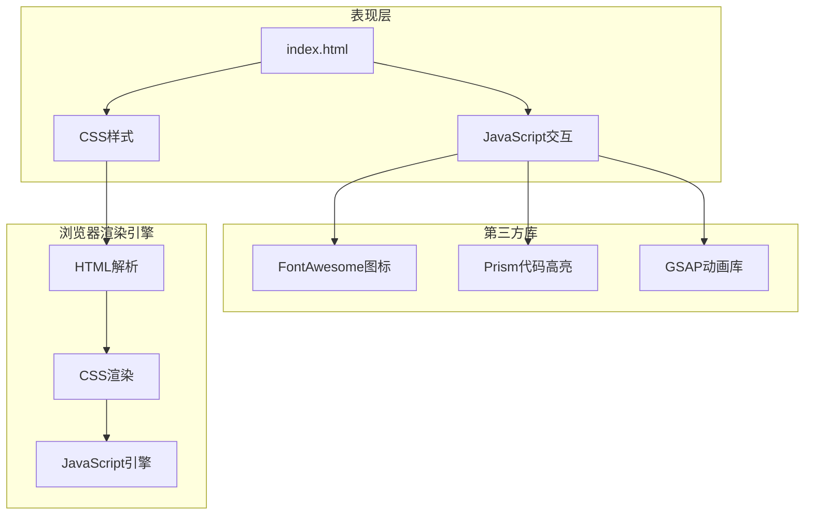
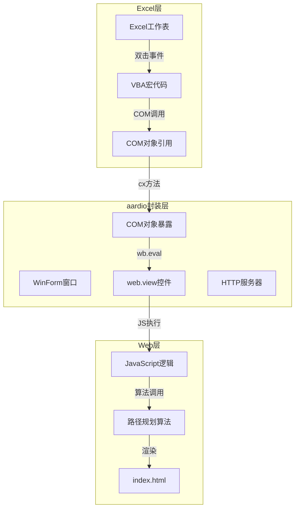

# 中图铁路地图 - 技术架构文档

## 1. 架构设计

这是一个**单页面展示型网站**，采用现代化的前端技术栈，无需后端服务。



## 2. 技术描述

### 前端技术栈

| 技术 | 版本 | 用途 |
|------|------|------|
| **HTML5** | 最新 | 语义化页面结构 |
| **CSS3** | 最新 | 样式、动画、响应式布局 |
| **JavaScript** | ES6+ | 交互逻辑、动画控制 |
| **FontAwesome** | 6.x | 图标系统 |
| **Prism.js** | 最新 | 代码语法高亮 |

### 文件组织

```
项目根目录/
├── index.html           # 主HTML文件
├── css/
│   ├── reset.css        # 样式重置
│   ├── variables.css    # CSS变量定义
│   ├── components.css   # 组件样式
│   ├── layout.css       # 布局样式
│   ├── animations.css   # 动画定义
│   └── main.css         # 主样式文件
├── js/
│   ├── utils.js         # 工具函数
│   ├── animations.js    # 动画控制
│   ├── interaction.js   # 交互逻辑
│   └── main.js          # 入口文件
└── assets/
    └── images/          # 图片资源（可选）
```

## 3. 核心模块设计

### 3.1 Hero区域模块

**功能**：展示震撼的视觉效果，吸引用户注意力

**组件**：
- 背景：CSS渐变 + SVG铁路线路图
- 动画：粒子流动效果（Canvas或CSS）
- 文字：渐入动画 + 打字机效果（可选）

```javascript
// 伪代码
class HeroAnimation {
    init() {
        this.canvas = document.getElementById('particle-canvas');
        this.animateParticles();
    }
    
    animateParticles() {
        // 使用requestAnimationFrame实现流畅动画
        requestAnimationFrame(() => this.animateParticles());
    }
}
```

### 3.2 功能卡片模块

**功能**：展示5个核心功能模块

**数据结构**：
```javascript
const features = [
    {
        icon: 'fa-map-marked-alt',
        title: '铁路网络展示',
        description: '基于D3.js的SVG地图渲染',
        color: '#1a365d'
    },
    {
        icon: 'fa-search-location',
        title: '智能站点搜索',
        description: '多维度模糊匹配搜索',
        color: '#38b2ac'
    },
    // ...更多功能
];
```

### 3.3 架构图模块

**功能**：交互式展示系统架构

**SVG结构**：
```html
<svg class="architecture-diagram">
    <g class="layer" data-layer="presentation">
        <rect class="node" />
        <text class="label" />
    </g>
    <!-- 更多层级 -->
</svg>
```

### 3.4 算法演示模块

**功能**：动态演示A*和Dijkstra算法执行过程

**动画状态机**：
```javascript
const Algorithm演示 = {
    states: ['初始化', '选择节点', '扩展邻居', '更新距离', '完成'],
    currentState: 0,
    
    nextStep() {
        this.currentState++;
        this.highlightCurrentStep();
        this.updateVisualization();
    }
};
```

## 4. CSS架构

### 4.1 CSS变量系统

```css
:root {
    /* 主色调 */
    --color-primary: #1a365d;
    --color-secondary: #38b2ac;
    --color-accent: #f6ad55;
    
    /* 背景色 */
    --bg-light: #f7fafc;
    --bg-dark: #edf2f7;
    
    /* 文字色 */
    --text-primary: #2d3748;
    --text-secondary: #718096;
    
    /* 间距 */
    --spacing-xs: 0.5rem;
    --spacing-sm: 1rem;
    --spacing-md: 2rem;
    --spacing-lg: 4rem;
    --spacing-xl: 6rem;
    
    /* 圆角 */
    --radius-sm: 4px;
    --radius-md: 8px;
    --radius-lg: 16px;
    
    /* 阴影 */
    --shadow-sm: 0 1px 3px rgba(0,0,0,0.1);
    --shadow-md: 0 4px 6px rgba(0,0,0,0.1);
    --shadow-lg: 0 10px 25px rgba(0,0,0,0.1);
    
    /* 动画 */
    --transition-fast: 0.2s ease;
    --transition-normal: 0.3s ease;
    --transition-slow: 0.5s ease;
}
```

### 4.2 组件样式规范

```css
/* 卡片组件 */
.card {
    background: white;
    border-radius: var(--radius-lg);
    box-shadow: var(--shadow-md);
    padding: var(--spacing-md);
    transition: transform var(--transition-normal),
                box-shadow var(--transition-normal);
}

.card:hover {
    transform: translateY(-8px);
    box-shadow: var(--shadow-lg);
}

/* 按钮组件 */
.btn {
    display: inline-flex;
    align-items: center;
    justify-content: center;
    padding: var(--spacing-xs) var(--spacing-sm);
    border-radius: var(--radius-md);
    font-weight: 600;
    transition: all var(--transition-fast);
}

.btn-primary {
    background: var(--color-primary);
    color: white;
}

.btn-primary:hover {
    background: var(--color-secondary);
    transform: scale(1.05);
}
```

## 5. JavaScript架构

### 5.1 模块化设计

```javascript
// main.js - 入口文件
import { initHero } from './animations.js';
import { initCards } from './components.js';
import { initArchitecture } from './interaction.js';

document.addEventListener('DOMContentLoaded', () => {
    initHero();
    initCards();
    initArchitecture();
    initScrollAnimations();
});
```

### 5.2 工具函数库

```javascript
// utils.js
export const $ = (selector) => document.querySelector(selector);
export const $$ = (selector) => document.querySelectorAll(selector);

export function throttle(func, limit) {
    let inThrottle;
    return function(...args) {
        if (!inThrottle) {
            func.apply(this, args);
            inThrottle = true;
            setTimeout(() => inThrottle = false, limit);
        }
    };
}

export function animateOnScroll(element, options = {}) {
    const observer = new IntersectionObserver((entries) => {
        entries.forEach(entry => {
            if (entry.isIntersecting) {
                entry.target.classList.add('animate-in');
            }
        });
    }, options);
    
    observer.observe(element);
}
```

## 6. 性能优化策略

### 6.1 CSS优化

- 使用CSS变量减少重复代码
- 使用`will-change`优化动画性能
- 使用`transform`和`opacity`实现GPU加速
- 合并多个CSS文件减少请求

### 6.2 JavaScript优化

- 使用`requestAnimationFrame`实现流畅动画
- 使用IntersectionObserver实现懒加载
- 防抖和节流优化滚动事件
- 代码分割，按需加载

### 6.3 资源优化

- 使用SVG图标减少图片请求
- 图片使用WebP格式（如果使用）
- 预加载关键CSS和字体
- 使用CDN加速第三方库

## 7. Excel集成架构

### 7.1 整体架构



### 7.2 集成模块设计

**功能**：实现Excel表格与铁路地图的联动，双击到站单元格自动生成路径

**数据流向**：
```
Excel单元格值 → VBA事件处理 → COM对象通信 → aardio桥接 → JavaScript执行 → 地图渲染
```

**核心组件**：

| 组件 | 职责 | 技术实现 |
|------|------|----------|
| VBA事件监听 | 捕获双击事件，提取到站名称 | Worksheet_BeforeDoubleClick |
| COM对象 | 进程间通信桥梁 | aardio COM暴露 |
| aardio封装 | 托管HTML，提供JS调用接口 | web.view + wsock.tcp.simpleHttpServer |
| JavaScript | 路径规划算法调用 | generatePath()函数 |

### 7.3 关键代码结构

```javascript
// aardio端COM对象定义
var ad = {
    msg: "连接成功！",
    cx: function(e) {
        if (!wb) return null;
        var cz = "generatePath('" ++ e ++ "')";
        return wb.eval(cz);
    }
};
```

### 7.4 进程管理策略

- **单实例保证**：启动前检查并关闭同名进程
- **连接状态检测**：通过COM对象是否为空判断连接状态
- **资源释放顺序**：先释放Excel引用 → 关闭浏览器 → 停止HTTP服务器

## 8. 浏览器兼容性

| 浏览器 | 最低版本 | 备注 |
|--------|----------|------|
| Chrome | 80+ | 完全支持 |
| Firefox | 75+ | 完全支持 |
| Safari | 13+ | 完全支持 |
| Edge | 80+ | 完全支持 |
| IE | 不支持 | 不考虑兼容 |

---

*文档版本：v1.0*
*创建时间：2026年5月31日*
